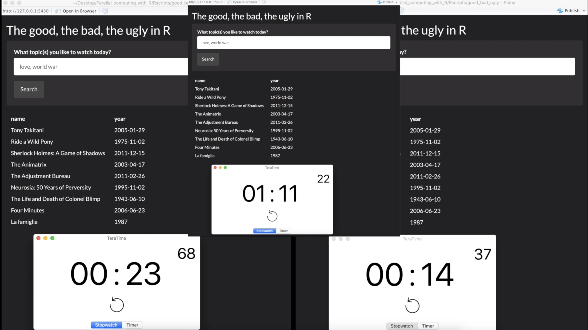
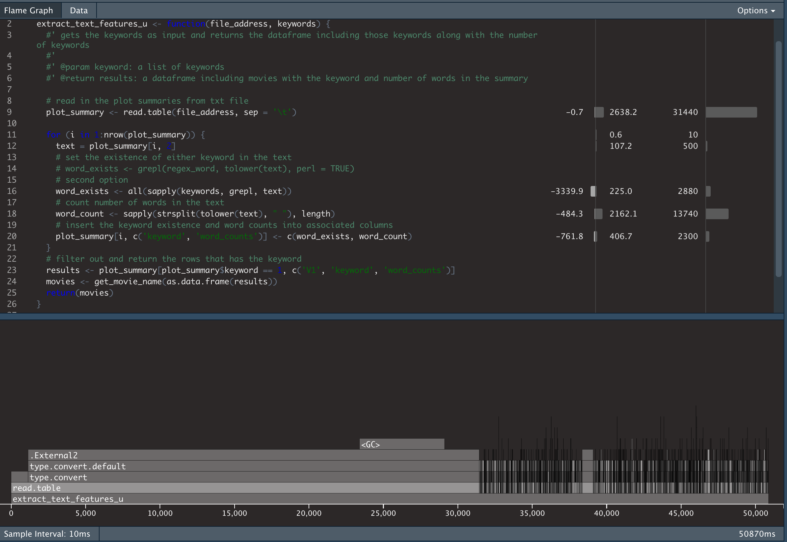
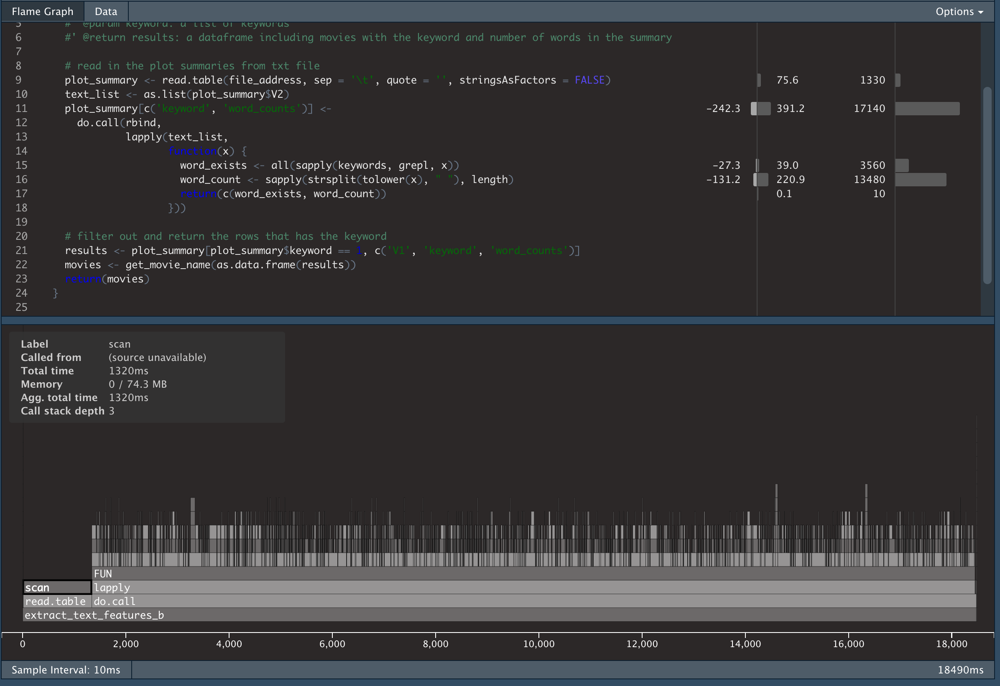
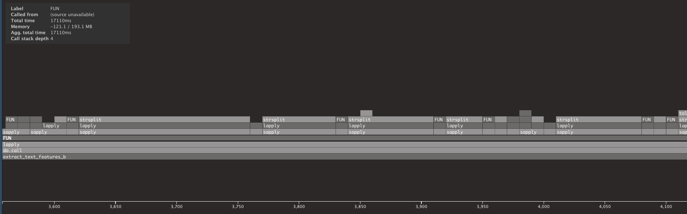
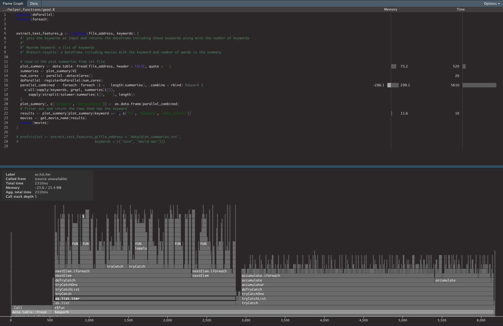

```{r setup, include=FALSE, echo=FALSE}
knitr::opts_chunk$set(echo = TRUE)
library(profvis)
```

Programming languages sometimes tend to be mean and stubborn. We might all remember days sitting behind the computer hoping for a fast and error-free results. **memory allocation errors** are the ugly side of the programming. But wait, those could be sign of your codes being sick! In a real life, you need regular check-ups to make sure you are doing fine. In the virtual life, your codes need check-ups too. It is time to stop complaining about our codes and computers and start profiling the application. The good news is it is not very difficult to do that in R. 


In this [blog](https://medium.com/@jahanpour.ehsan/the-good-the-bad-the-ugly-in-r-72e55b2219cc), I have gone through ugly, bad and good techniques to write codes for reading in and searching through datasets. This [repository](https://github.com/ejahanpour/MovieSearchShiny) includes a Shiny app that implements those concepts. The app, in general gets keywords and return the movies with those subjects. Please feel free to clone the repo if would like to follow the steps with me or interested in a shiny app to help you find a movie to watch in a peaceful night. The execution time for each technique is shown below: we could reduce the application's response time from 71 seconds to 14 seconds!! In this post, I will explain how I applied profiling techniques and graphs to evaluate Rscripts and improve application response time. 



We will start with reading in the movie datasets using `read.table` and loop through R dataframe object. The Rscript is available at `helper_functions/ugly.R` and described in [this blog](https://medium.com/@jahanpour.ehsan/the-good-the-bad-the-ugly-in-r-72e55b2219cc). The application took 71 seconds to return the movies with two keywords. In order to speed up the app, we need to find out the bottlenecks in our code. [profvis](https://rstudio.github.io/profvis/) is a tool that visualizes how R is spending its time to run the program. You can follow the link to install and gain more insight around it. Since profvis library is producing interactive visualizations, I have created a [YouTube video](https://www.youtube.com/watch?v=tqrveDnoJsc) that walks through these profiling steps in a more visual format. Please note that the timelines will depend on your computer performance and you might get a different number than mine. The relative execution time between different code lines should stay the same though. Figure below shows the profvis results of `ugly.R` codes:


```{r ugly, eval=FALSE}
source("../helper_functions/ugly.R")
profvis::profvis(extract_text_features_u(file_address = '../datasets/plot_summaries.txt',
                                   keywords = c("love", "world war")))
```



**profvis** generates two views to visualize the codes running time and memory allocation/deallocation. The first view is "Flame graph" which is timeline of stacked function runs in R. The view is interactive and you can zoom in and extend the timeline for more insights on execution process. Based on the timeline, R has spent 31 seconds out of total 50 seconds to read in the dataset! The stacked bars shed more light on how those 31 seconds were spent. The stack goes up to `.External2` function which is calling a compiled C function for type conversion. 31 second is a long execution time for reading around 42k text data. Since the dataset are texts and we do not need to "convert" them to factor, we might use `stringsAsFactors = FALSE` to avoid the bottleneck. Memory usage is another useful metric shown in the Flame graph. Although it does not show the current line's memory allocation/deallocation in the application, it can give us a general overview on how our application is dealing with memory (for more details please checkout [here](https://rstudio.github.io/profvis/faq.html#how-do-i-interpret-memory-profiling-information)). Positive values are allocation and negative values are deallocation amounts in megabytes. The 3.4GB of deallocation could be an indication of the redundant memory allocation and from  [this post](https://medium.com/@jahanpour.ehsan/the-good-the-bad-the-ugly-in-r-72e55b2219cc) we already know that for loop on data.frame generates a lot of those. In the second implementation, we disable stringsASFactors conversion and use lapply instead of for loop. Below is the flame graph:


```{r bad, eval=FALSE}
source("../helper_functions/bad.R")
profvis::profvis(extract_text_features_b(file_address = '../datasets/plot_summaries.txt',
                                    keywords = c("love", "world war")))
```



That is interesting!! Those small changes reduced the execution time to 18.5 seconds and reading dataset in is not a bottleneck anymore. The memory allocation and deallocation is in great shape too (nothing too nasty). Now, the bottleneck is the do.call function that calls lapply(). Zooming into lapply FUN timeline (image below) shows a lot of serialized sapply functions stacked on lapply function. 



This is the moment where understanding the structure of your code matters. Since each step of the loop is independent and the function takes long enough to process (see [here](https://medium.com/@jahanpour.ehsan/the-good-the-bad-the-ugly-in-r-72e55b2219cc)), parallel computing can be an option to improve the performance of the application. In addition, I used the awesome [fread](https://www.rdocumentation.org/packages/data.table/versions/1.12.8/topics/fread) which is faster than raed.table() function. Those changes lead us to our next profiling results:


```{r good, eval=FALSE}
source("../helper_functions/good.R")
profvis::profvis(extract_text_features_g(file_address = '../datasets/plot_summaries.txt',
                                    keywords = c("love", "world war")))
```




Great! The execution time is now down to 6 seconds with lots of stacked functions on top of each other!! The reading process shortened from 1.5 second to 0.5 second. The main session in R spent around 2.5 seconds (from second 500ms to 3000ms in the timeline) to run the functions and 3 seconds to accumulate results from different cores and bind them together.  It is important to note that the profvis is only visualizing the execution of the main session and does not visualize the execution in the child sessions. To obtain more details about the execution time in all sessions, please take a look at  [sytem.time()](https://www.rdocumentation.org/packages/base/versions/3.6.2/topics/system.time).

