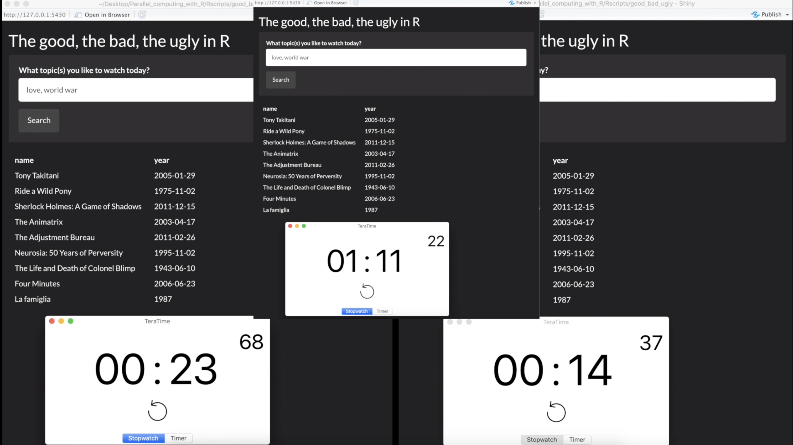
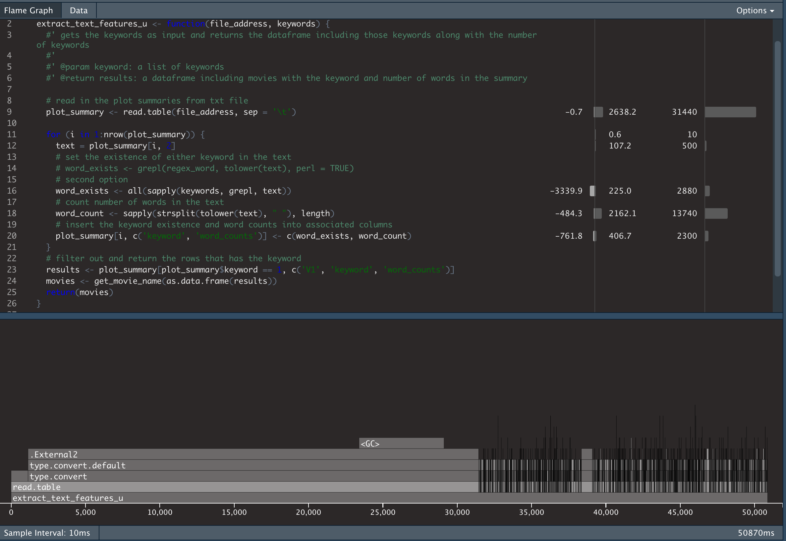
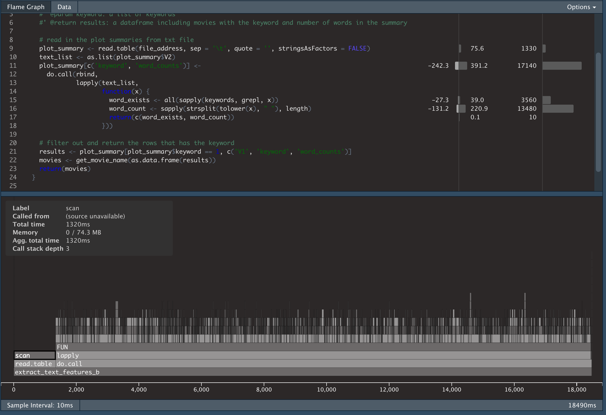
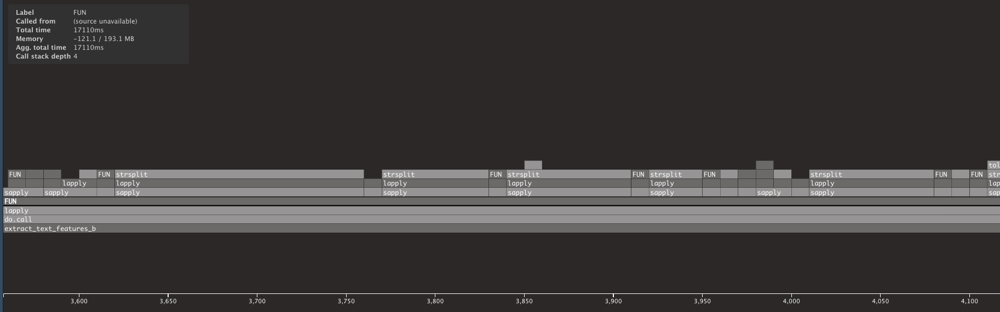
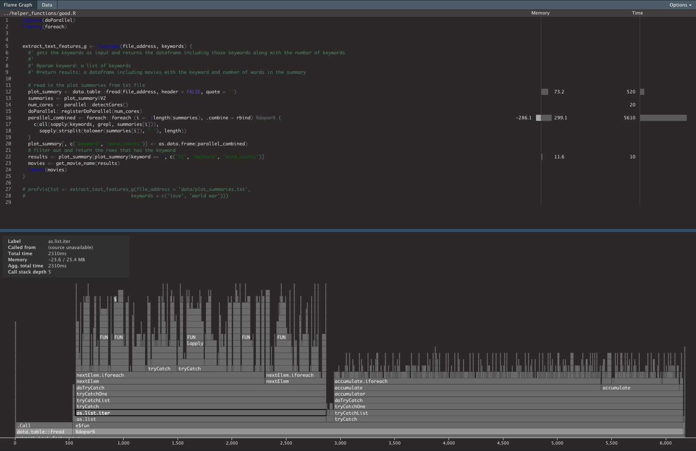

```{r setup, include=FALSE, echo=FALSE}
knitr::opts_chunk$set(echo = TRUE)
library(profvis)
```

programming languages sometimes become mean and stubborn. We might all have days sitting behind the computer begging him for a faster error-free results. **memory allocation errors** are nasty. But wait, those could be sign of your codes being sick! You need regular check-ups to make sure you are doing fine, so does your codes. so stop complaining your program and machine and start profiling your code. 


In this [blog](https://medium.com/@jahanpour.ehsan/the-good-the-bad-the-ugly-in-r-72e55b2219cc), I have gone through ugly, bad and good techniques to read and search through datasets. This [repository](https://github.com/ejahanpour/MovieSearchShiny) include a Shiny app that implement those concepts. The app gets keywords and return the movies with those subjects. Please feel free to clone and use it if you would like to find a movie for a peaceful night or would like to follow the steps with me. As image below shows the three implementations, we could reduce the running time from 71 seconds to 14 seconds!! In this post, I will explain how profiler graphs and data can be used as a check-up results to evaluate Rscripts and prescribe a remedy to improve application run time. 



Let's start with profiling the ugly implementation. The Rscript is available at `helper_functions/ugly.R` and described in the [blog](https://medium.com/@jahanpour.ehsan/the-good-the-bad-the-ugly-in-r-72e55b2219cc). [profvis](https://rstudio.github.io/profvis/) is a tool to visualizes how R is spending its time to run your program. You can follow the link to install and gain more insight around the tool. Since profvis library is producing interactive visualizations, I have created a [youtube video]() that walks through the profiling steps in a more visual format. Let's go ahead and profvis the ugly implementation. Please note that the timing will depend on your computer and you might get a different number as my run. but the relative timing between lines of codes should be similar.


```{r ugly, eval=FALSE}
source("../helper_functions/ugly.R")
profvis::profvis(extract_text_features_u(file_address = '../datasets/plot_summaries.txt',
                                   keywords = c("love", "world war")))
```



the **profvis** generates two views to show the codes running time and memory allocation/deallocation. The first view is "Flame graph" that is timeline of stacked function runs in R. The view is interactive and you can extend the timeline to gain more insights on the execution environment. Apparently, R has spent 31 seconds of the total 50 seconds to read in the dataset! The stacked timeline shed more light on how those 31 seconds are being spent. The stack goes up to `.External2` function which is calling a compiled C function for type conversion. 31 second is a long execution time for reading around 42k text data. Since the dataset are texts and we do not need to "convert" them to factor, we can use `stringsAsFactors = FALSE` to avoid the bottleneck. Memory usage is another metric shown in the Flame graph. Although it does not show the current line's memory allocation/deallocation in the application, it can give us a general overview on how our application is dealing with memory (for more details please checkout [here](https://rstudio.github.io/profvis/faq.html#how-do-i-interpret-memory-profiling-information)). The negative values are deallocation and positive values are the allocation ampounts in megabytes. The 3.4GB of deallocation during garbage cleaning process could be an indication of the redundant memory allocation and from  [this post](https://medium.com/@jahanpour.ehsan/the-good-the-bad-the-ugly-in-r-72e55b2219cc) we know that for loop with data.frame generates a lot of those. In the second implementation, we used lapply and disabled stringsASFactors conversion.


```{r bad, echo=FALSE, eval=FALSE}
source("../helper_functions/bad.R")
profvis::profvis(extract_text_features_b(file_address = '../datasets/plot_summaries.txt',
                                    keywords = c("love", "world war")))
```



Wow, those small changes reduced the execution time to 18.5 seconds and reading dataset in is not a bottleneck anymore. The memory usage is in great shape too (nothing too nasty). Now, the bottleneck is the do.call function that calls lapply() functions. As seen in the zoomed image below, there are a lot of serialized sapply functions stacked on lapply function. 



Parallel computing can be applied to improve the performance of those independent sapply functions. That leads us to the next profvis on Parallel implementation using foreach:


```{r good, echo=FALSE, eval=FALSE}
source("../helper_functions/good.R")
profvis::profvis(extract_text_features_g(file_address = '../datasets/plot_summaries.txt',
                                    keywords = c("love", "world war")))
```




The execution time is down to 6 seconds with lots of stacked functions on top of each other. It is improtant to note that the profvis is only visualizing the execution of the main session and it does not include the execution in the child sessions created in other cores of the machines. For more detailed information about the execution time in all the sessions, `sytem.time()` can be useful. 